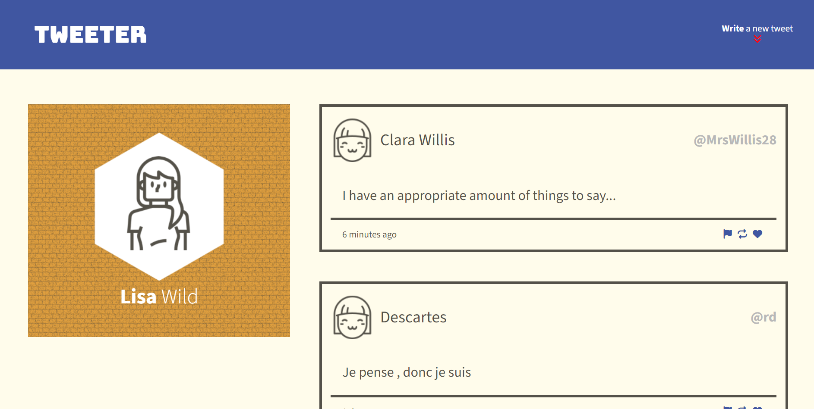
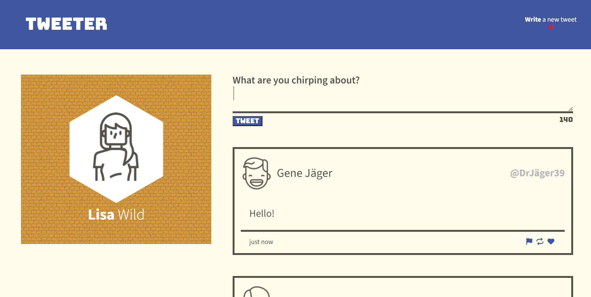
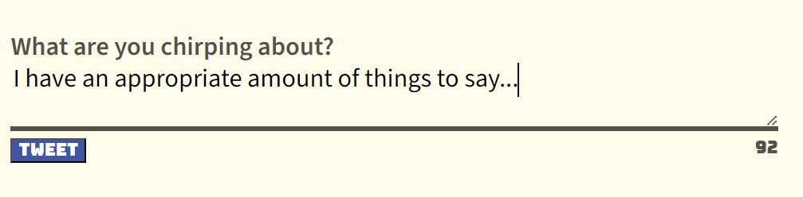
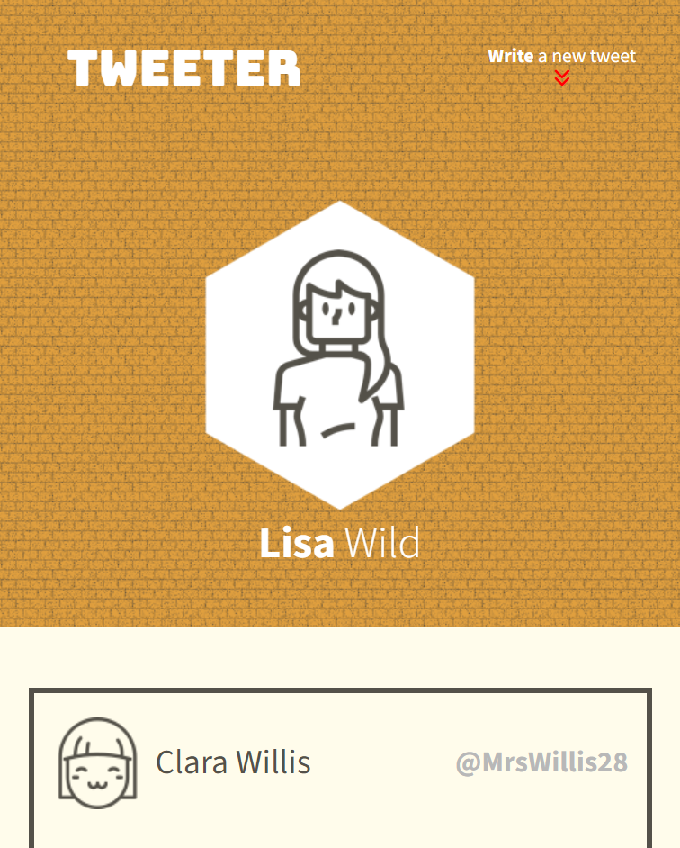
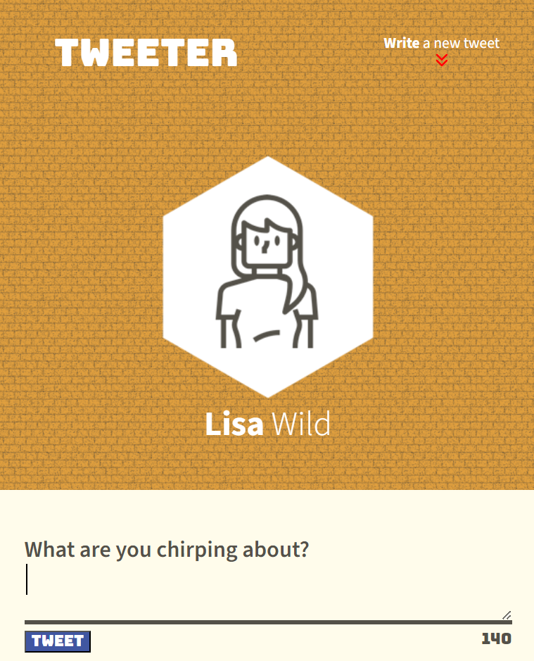
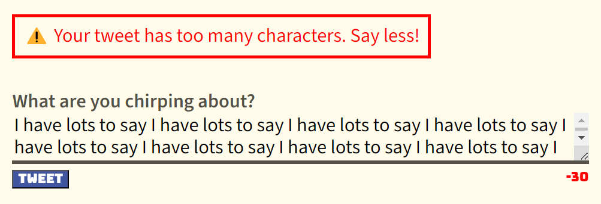
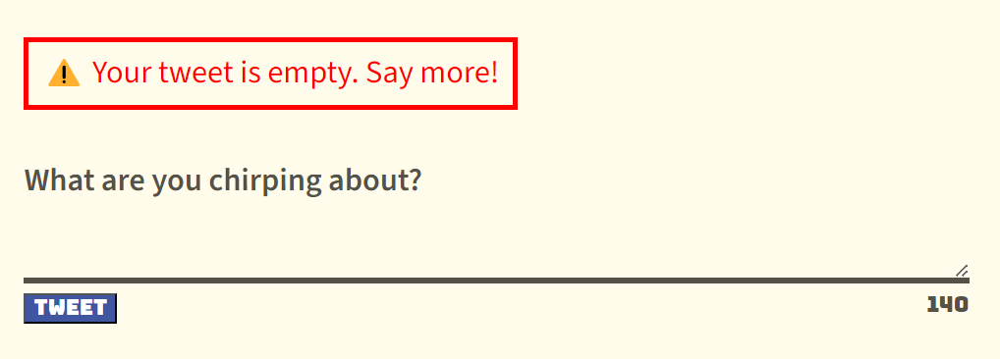

# Tweeter Project 🐥

This single-page application (SPA) is a clone of Twitter/X, called Tweeter.

This project provided the opportunity to work with newly learned HTML, CSS, SASS, jQuery and AJAX, and continue to develop JS, Node, and Express back-end skills. 

Features to Highlight:
- Use of media queries to create attractive responsive design for larger or smaller screens
- Timeago library used to format the timestamp on posted tweets
- Character counter and corresponding error messages
- Aesthetic choice of profile image background
- Use of jQuery to toggle the new tweet container on and off the page
- Hover features (cursor pointer, shadows)

Stretch Features to highlight:
- "Write a new tweet" button in the navbar toggles the new tweet container in and out of view
- SASS was partially used to streamline use of primary and secondary fonts and colors

## Installation

1. Clone the repository:
```bash
git clone https://github.com/liisawiild/tweeter.git
```

2. Navigate to the project directory:
```bash
cd tweeter
```

3. Install dependencies (including dev):
```bash
npm install
```

## Run Application
1. a) To start the server, run:
```
npm run start
```

1. b) To run the server with automatic restart on file changes (using nodemon), run:
```
npm run local
```

2. Open your web browser and navigate to [http://localhost:8080](http://localhost:8080).

## Dependencies
- Express
- Node 5.10.x or above
- Body-Parser
- Chance
- md5

## Developer Dependencies
- SASS
- Nodemon


### Sneak-Peeks of the Final Product
#### Homepage



#### Narrow Window (below width of 1024px)


#### Error Messages




